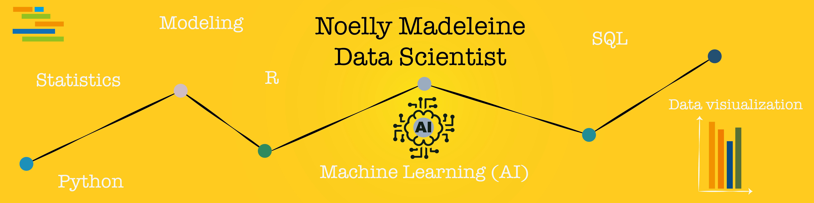

# Noelly's Data Science Portfolio  👋

Welcome to my GitHub profile! This repository showcases my work as a versatile data scientist, focusing on data analysis, visualization, and machine learning (AI). Here you will find projects and code samples in Python, SQL, and R, demonstrating my skills and passion for leveraging data to gain insights and build predictive models. 

## About Me 😀

I am a passionate and versatile data scientist with a strong background in bioinformatics. With a Ph.D. in Bioinformatics, I bring a unique perspective to data analysis, specializing in large-scale biological datasets. I have extensive experience using **Python**, **SQL**, and **R**, along with libraries such as **Pandas**, **NumPy**, **Matplotlib**, **Seaborn**, and **Scikit-learn**, to uncover patterns and gain insights from complex biological systems.

**Beyond bioinformatics**, my love for data analysis extends to various domains. I thrive on exploring diverse datasets, from structured databases to unstructured text, and extracting valuable insights. I have honed my skills in **data analysis**, **visualization**, and **machine learning**, enabling me to tackle analytical challenges across different projects.

Feel free to explore the projects and code samples in this repository to get a deeper understanding of my expertise and capabilities as a data scientist.

## Contact Me 📧

I am always eager to connect with other data enthusiasts and professionals. If you have any questions, suggestions, or collaboration opportunities, please feel free to reach out to me via the following channels:

- Email : [email](mailto:noelly.madeleine@gmail.com) 
- LinkedIn: [LinkedIn](https://fr.linkedin.com/in/noelly-madeleine-62b62699)

Thank you for visiting my profile repository, and I hope you find my work informative and inspiring!
